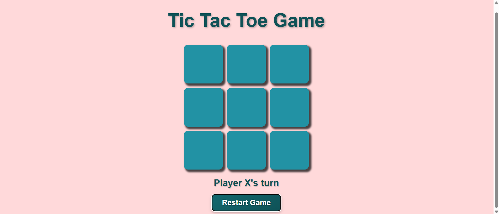

# 🎮 Tic-Tac-Toe Game

A simple and interactive **Tic-Tac-Toe** game built using **HTML**, **CSS**, and **JavaScript**. This project allows two players to play the classic Tic-Tac-Toe game in a clean, responsive, and user-friendly interface.

---

## 📸 Preview



---

## ✨ Features

- 🎲 Two-player gameplay (Player X and Player O)
- ❌⭕ Automatic turn switching
- 🏆 Win detection
- 🤝 Draw detection
- 🔄 Restart game button
- 🎨 Modern and responsive user interface
- ⚡ Fast and lightweight

---

## 🛠️ Technologies Used

- HTML5
- CSS3
- JavaScript (Vanilla JS)

---

## 📂 Project Structure

```text
Tic-Tac-Toe-Game/
│
├── images/
│   └── homepage.png
├── index.html
├── style.css
├── script.js
└── README.md
```

---

## 🚀 Getting Started

### Clone the Repository

```bash
git clone https://github.com/MehediNoorNeo/Tic-Tac-Toe-Game.git
```

### Navigate to the Project Folder

```bash
cd Tic-Tac-Toe-Game
```

### Run the Project

Simply open the `index.html` file in your favorite web browser.

No installation or additional dependencies are required.

---

## 🎮 How to Play

1. Player **X** starts the game.
2. Players take turns selecting an empty square.
3. The first player to place **three marks in a row** (horizontal, vertical, or diagonal) wins.
4. If all nine squares are filled without a winner, the game ends in a draw.
5. Click the **Restart Game** button to play again.

---

## 📷 Screenshot

| Desktop View |
|--------------|
|  |

---

## 🎯 Learning Objectives

This project was built to practice:

- HTML page structure
- CSS styling and layout
- CSS Grid
- Responsive design
- DOM Manipulation
- JavaScript event handling
- Game logic implementation

---

## 🔮 Future Improvements

- 🤖 Single-player mode (AI opponent)
- 🎵 Sound effects
- 🌙 Dark mode
- 📊 Scoreboard
- 🎉 Winning animations
- 📱 Improved mobile responsiveness

---

## 🤝 Contributing

Contributions are welcome!

1. Fork the repository.
2. Create a feature branch.

```bash
git checkout -b feature-name
```

3. Commit your changes.

```bash
git commit -m "Add new feature"
```

4. Push your branch.

```bash
git push origin feature-name
```

5. Open a Pull Request.

---

## 📄 License

This project is open-source and available for educational and personal learning purposes.

---

## 👨‍💻 Author

**Mehedi Hasan**

- GitHub: https://github.com/MehediNoorNeo

---

⭐ If you like this project, don't forget to **Star** the repository!